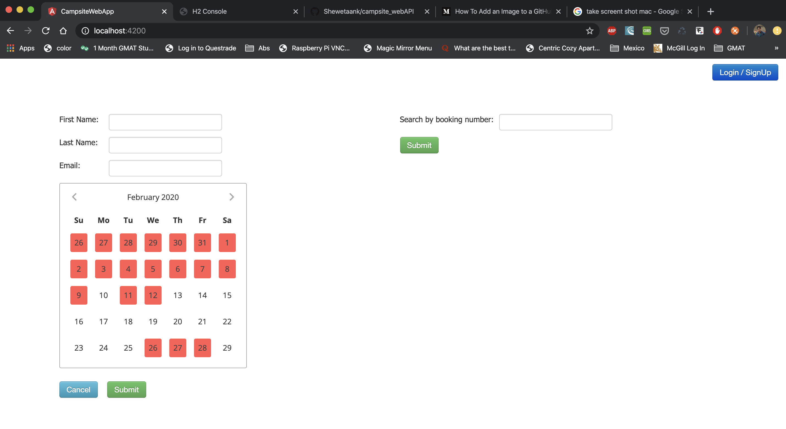

# CampsiteWebApp

This project was generated with [Angular CLI](https://github.com/angular/angular-cli) version 8.0.3.
The angular app is uses the campsite_webAPI backend to send the info to the server to make and get registration.

Few things about the App- 
1. The angular app has two main pages the home page (http://localhost:4200) which is the landing page to the web app. It contains a web form to create new registration and a spearate component to check for the existing bookings. (Please keep the booking number handy while testing) which allows the user to update and delete an existing booking.

2. The second page on the angular app is for the logged in users. You can try that out by registering to the app and following instructions after clicking the Login/Singup link on the main landing page.
3. While making a new booking you have to proivde all the details, firstName, lastName, Email & dates to compelete the booking. In case of any missing info error will be given to the user.
4. The calendar on the registration component only allow users to make booking for upto 30 days in advance. Rest all the dates are disabled by default. Also, the calendar uses date ranges, so in case you select range of dates greater than 3 or a range with a disabled date inbetween an error will be thrown.
5. The booking component allows the user to search, update and delete the booking. Delete booking requires user confirmation via a pop-up, while edit button will pre-fill the booking info to the campsite component form. Updating a booking do not changes your booking number.
6. Also, in case you register to the website, while testing it use your work-email. 
7. If you made a booking as an anonymous user and then when you register to the website, you can still see all your bookings since the app uses email address and userID to populate your bookings list. 
8. The booking component looks different for the logged in users, you don't have search booking functionality there since all your bookings will be loaded when you log in.

## Development server

Run `ng serve` for a dev server. Navigate to `http://localhost:4200/`. The app will automatically reload if you change any of the source files.

## Code scaffolding

Run `ng generate component component-name` to generate a new component. You can also use `ng generate directive|pipe|service|class|guard|interface|enum|module`.
